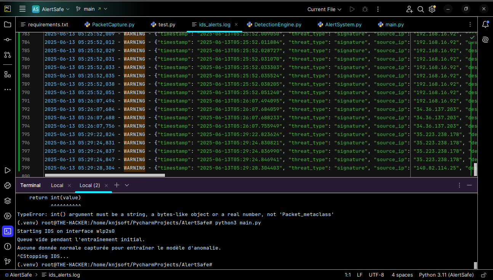

# AlertSafe

AlertSafe est un système d'alerte et de détection d'intrusion (IDS) qui permet de surveiller et d'analyser les paquets réseau en temps réel.

## Fonctionnalités

- Surveille les paquets réseau en temps réel
- Analyse les paquets réseau en temps réel
- Détection des paquets réseau en temps réel
- Alertes en temps réel
- Journalisation des alertes
- Journalisation des paquets réseau
- Entrainer le modèle

## Installation

```bash
pip install -r requirements.txt
```

## Utilisation

```bash
python main.py
```

## Test
```bash
python test.py
```

## Exemple



copyright © 2025 AlertSafe | Tous droits réservés
